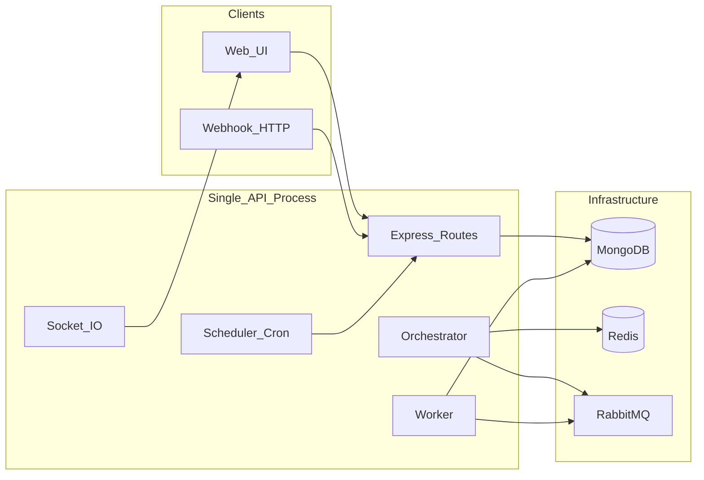

# AI Automation — proje teknik hafızası

Bu dosya yeni ajan / geliştirici oturumlarında bağlam sağlamak içindir. Kod değiştikçe ilgili bölümler güncellenmelidir.

**Son güncelleme:** 2026-04-21 (Telegram P0/P1 mimarisi: `telegram.message`/`telegram.trigger`, `TelegramEvent`, `TelegramSession`)

---

## 1. Amaç

Görsel workflow editörü ile tanımlanan otomasyonların çalıştırılması: **manuel**, **cron** ve **webhook** tetikleyicileri; adım bazlı yürütme (AI, HTTP, e-posta, Slack vb.); çalışma geçmişi, metrikler ve gerçek zamanlı güncellemeler (Socket.IO).

---

## 2. Repo yapısı

| Konum | İçerik |
|--------|--------|
| Kök [`package.json`](../package.json) | Node **ESM** (`"type": "module"`). API ve script bağımlılıkları burada. Komutlar: `npm run api`, `npm run web`, `npm run test:all`. |
| [`apps/api/src/`](../apps/api/src/) | Express HTTP API, RabbitMQ/Redis/Mongo konfigürasyonu, **orchestrator** + **worker** + **scheduler**, Mongoose modelleri, pluginler, yardımcılar. |
| [`apps/web/`](../apps/web/) | **Vite 7**, **React 19**, **TypeScript**, **React Flow** (graf), **Tailwind 4**, **socket.io-client**. |
| [`scripts/`](../scripts/) | Entegrasyon / yük testi scriptleri; `run-all-tests.js` çekirdek + genişletilmiş testleri yönetir. |
| [`docs/`](../docs/) | Bu belge + diyagramlar (`api.drawio`, `web.drawio`). |

---

## 3. Çalışma zamanı (yüksek seviye)

Tek Node sürecinde API sunucusu ayağa kalkınca **aynı process** içinde şunlar da başlar: Rabbit tüketimi / yayınlama (orchestrator + worker), cron scheduler, Socket.IO.



---

## 4. API giriş noktası

Dosya: [`apps/api/src/index.js`](../apps/api/src/index.js)

**Başlangıç sırası:** `connectRabbit()` → `connectDB()` → `seedTemplatesIfEmpty()` → HTTP + Socket.IO → route’lar → `startOrchestrator({ io })` → `startWorker({ io })` → `startScheduler()`.

**Global middleware:** `cors` (şu an `origin: *`), `express.json` limiti `MAX_PAYLOAD_SIZE` (varsayılan `1mb`), 413 için hata yakalayıcı.

| Yol | Kimlik | Not |
|-----|--------|-----|
| `/docs` | Yok | Swagger UI |
| `/auth` | Endpoint bazlı (`/me` → `requireAuth`) | Kayıt / giriş / me |
| *(global)* | `authOptional` | JWT varsa `req.user` dolar; yoksa ortama göre davranış (bkz. §5) |
| `/runs`, `/workflows`, `/credentials`, `/templates`, `/users` | `requireAuth` | Sahiplik filtreleri route içinde |
| `/trigger`, `/webhook` | Route’ta zorunlu JWT yok | Webhook koruması rate limit + secret/imza ile |
| `/plugins` | JWT yok | Plugin listesi / şema (UI için) |
| `/metrics`, `/monitoring` | `requireAuth` + `requireAdmin` | Admin |

`/trigger` ve `/webhook` aynı router’a bağlı: [`trigger.routes.js`](../apps/api/src/routes/trigger.routes.js).

---

## 5. Kimlik doğrulama

Dosyalar: [`apps/api/src/middleware/auth.js`](../apps/api/src/middleware/auth.js), [`apps/api/src/routes/auth.routes.js`](../apps/api/src/routes/auth.routes.js)

- **Access JWT:** `signAccessToken` — payload: `sub`, `email`, `role`; süre **1 saat**.
- **Refresh JWT:** `signRefreshToken` — `type: "refresh"`, süre **14 gün**; response’ta login/register ile dönülür.
- **Sırlar:** `JWT_ACCESS_SECRET`, `JWT_REFRESH_SECRET`. Prod’da boşsa hata.
- **`AUTH_REQUIRED`:** Tanımlıysa string `"true"` / `"false"` ile; tanımsızsa prod’da `true` kabul edilir.
- **`authOptional`:** `Authorization: Bearer` geçerliyse `req.user` set edilir. Hata durumunda sessizce `next()` (token geçersizse user yok).
- **Bearer yok:** Prod’da ve `AUTH_REQUIRED` uygunsa `req.user` set edilmez (sonraki `requireAuth` 401). **Geliştirme kolaylığı:** `AUTH_REQUIRED` false ve prod değilken ilk kullanıcı oluşturulup / seçilip `req.user` atanıyor (`dev@local.dev`, rol `admin`).
- **Roller:** `user` | `admin` — model [`user.model.js`](../apps/api/src/models/user.model.js).

**Teknik borç:** `User` şemasında `refreshTokenHash` var; **refresh token doğrulama / yenileme endpoint’i** ve hash kaydı bu hafıza dosyası yazıldığında tam bağlanmamış olabilir — kontrol ederek burayı güncelleyin.

---

## 6. Veri modelleri (MongoDB / Mongoose)

| Model | Dosya | Özet |
|-------|--------|------|
| **User** | [`models/user.model.js`](../apps/api/src/models/user.model.js) | `email` (unique), `passwordHash`, `name`, `role`, opsiyonel `refreshTokenHash`. |
| **Workflow** | [`models/workflow.model.js`](../apps/api/src/models/workflow.model.js) | `userId`, `name`, `enabled`, `trigger` (`manual` \| `cron` \| `trigger.webhook`), webhook alanları, `onErrorStepId`, üst düzey `steps` + `versions[]` ile **sürümleme**, `currentVersion`, adım: `dependsOn`, `branch`, `errorFrom`, `retry`, `timeout`, vb. |
| **Run** | [`models/run.model.js`](../apps/api/src/models/run.model.js) | `userId`, `workflowId`, `status` (queued/running/completed/failed/cancelled), `workflowVersion`, `triggerPayload`, `stepStates[]` (iteration, executionId, retryCount, status), `loopState` / `loopContext`, `outputs` Map, `processedMessages` (idempotency), `lastError` vb. |
| **Credential** | [`models/credential.model.js`](../apps/api/src/models/credential.model.js) | `userId`, `name`, `type`, şifreli `data` string; JSON çıktısında `data` silinir. |
| **Template** | [`models/template.model.js`](../apps/api/src/models/template.model.js) | Kullanıcıya özel kayıtlı workflow şablonları (`workflow` Mixed). |

Workflow snapshot ve ownership kuralları route katmanında `userId` ile sınırlanır (ör. [`workflow.routes.js`](../apps/api/src/routes/workflow.routes.js) içinde `ownedWorkflowQuery`).

---

## 7. RabbitMQ

Dosya: [`apps/api/src/config/rabbit.js`](../apps/api/src/config/rabbit.js)

- **Exchange:** `automation.direct` (direct, durable).
- **Prefetch:** `WORKER_MAX_CONCURRENCY` (sayısal, varsayılan mantık 5).
- **Routing key’ler ve kuyruklar (özet):**
  - `run.start` → `run.start.q`
  - `step.execute` → `step.execute.q`
  - `step.result` → `step.result.q`
  - `run.cancel` → `run.cancel.q`
  - `step.retry` → DLX ile `step.retry.fire` → `step.retry.fire.q`
  - `step.timeout` → DLX ile `step.timeout.fire` → `step.timeout.fire.q`
  - `step.cancel` → `step.cancel.q`
  - `dispatch.kick` → `dispatch.kick.q` (global slot boşalınca tetikleme)
  - `workflow.created` → `workflow.created.q`

---

## 8. Redis

Orchestrator tarafında örnek kullanımlar: **hazır run sırası** (`runs:ready` ZSET), **global eşzamanlı adım limiti** (`GLOBAL_MAX_INFLIGHT`, Lua script ile token/idempotency; anahtarlar `global:inflight`, `global:tokens`), isteğe bağlı diğer koordinasyon.

**Dayanıklılık:** [`apps/api/src/utils/redisSafe.js`](../apps/api/src/utils/redisSafe.js) içinde `withRedisFallback(operationName, fn, fallbackValue)` — Redis hata verirse log + `redisDegraded` ve **fallback değeri** ile devam (işlevsellik sınırlı mod).

---

## 9. Motor: Orchestrator ve Worker

### Orchestrator

Dosya: [`apps/api/src/engine/orchestrator.js`](../apps/api/src/engine/orchestrator.js) (büyük dosya)

- Run yaşam döngüsü: kuyruğa alma, adım seçimi, bağımlılık / switch branch / **loop**, retry ve timeout mesajları, iptal.
- Koşul değerlendirme: [`utils/condition.js`](../apps/api/src/utils/condition.js).
- Değişken çözümleme: [`utils/variableResolver.js`](../apps/api/src/utils/variableResolver.js).
- Retry / breaker: [`utils/retryGuard.js`](../apps/api/src/utils/retryGuard.js).
- Socket.IO örnek olaylar: `run:update`, `runs:update`, `run:log`, `step:update`, `workflow:create` (`io.to('run:'+id)` veya global `io.emit`).
- **Crash recovery (process restart):** `startOrchestrator` sonunda `reconcileRunsOnStartup` çalışır. `status: running` run’larda, süreç ölümü sonrası Mongo’da takılı kalan **worker adımlarının** (`stepStates` içinde `running` / `retrying`) snapshot’taki tipe göre **`foreach` / `if` hariç** tamamı **`pending`** yapılır; run log’a `[RECOVERY] … reset to pending` düşer (`normalizeOrphanWorkerStepsForRun`). Böylece `dispatchReadySteps` zombi adımları paralel slot doldurmuş saymaz ve yürütme yeniden kuyruklanır. `pumpReadyRuns`, run’ı `runs:ready` zset’inden yalnızca **hem `pending` yok hem de** (foreach/if sayılmayan) **worker inflight yoksa** çıkarır (`hasWorkerInflightStepStates`); aksi halde sadece `pending` olmayan zombi run’lar kaybolmaz. **Trade-off:** sıfırlanan adım yeniden çalışır; idempotent olmayan HTTP POST vb. tekrarlanabilir. Doğrulama: `node scripts/crash-recovery-test.js` (mantık senkron assert; API gerekmez).

### Worker

Dosya: [`apps/api/src/engine/worker.js`](../apps/api/src/engine/worker.js)

- Kuyruktan `step.execute` benzeri mesajlarla plugin çalıştırır.
- **Credential:** decrypt + kısa süreli bellek önbelleği; `CREDENTIAL_CACHE_TTL_MS`, `CREDENTIAL_CACHE_MAX`.
- **İptal:** `executionId` başına `AbortController`.
- **Timeout:** `WORKER_PLUGIN_TIMEOUT_MS` (>0 ise plugin executor race).
- **Chaos test:** `CHAOS_MODE`, `CHAOS_SEED` (deterministik testler için).
- Adım kilidi / geçerlilik: `STEP_LOCK_TTL_MS`, `processedMessages` ve `stepStates` ile tekrar işleme önleme.

### Scheduler

Dosya: [`apps/api/src/config/scheduler.js`](../apps/api/src/config/scheduler.js) — cron ile tetikleme; workflow route’ları cron kaydı için scheduler’ı çağırır.

---

## 10. Plugin sistemi

- Yükleme: [`plugins/index.js`](../apps/api/src/plugins/index.js) — dizindeki `.js` dosyaları (index/registry hariç) dinamik import; sözleşme: `type`, `label`, isteğe bağlı `schema`, tetikleyici pluginlerde `trigger: true`, diğerlerinde `executor` / `execute`.
- **Alias:** `openai` yüklenirse `plugins.ai` aynı modüle bağlanır (workflow’da `ai` tipi).
- Registry: [`plugins/registry.js`](../apps/api/src/plugins/registry.js) — `getPlugin`, `getAllPlugins`, `getPluginSchema`.

**Kayıtlı `type` değerleri (dosya adı — tip):**

| Dosya | `type` |
|--------|--------|
| `openai.plugin.js` | `openai` (+ alias `ai`) |
| `ai.summarize.js` | `ai.summarize` |
| `http.request.js` | `http` |
| `email.js` | `email` |
| `slack.js` | `slack` |
| `delay.js` | `delay` |
| `setVariable.js` | `setVariable` |
| `template.js` | `template` |
| `transform.js` | `transform` |
| `merge.js` | `merge` |
| `log.js` | `log` |
| `code.js` | `code` |
| `switch.js` | `switch` |
| `parallel.js` | `parallel` |
| `task.js` | `task` |
| `telegram.message.js` | `telegram.message` |
| `telegram.trigger.js` | `telegram.trigger` (trigger) |
| `trigger.cron.js` | `trigger.cron` (trigger) |
| `unstable.js` | `unstable` (test / simülasyon) |

### 10.1 Telegram entegrasyonu (P0/P1)

- **P0 Bot API (aktif):**  
  - Plugin: [`apps/api/src/plugins/telegram.message.js`](../apps/api/src/plugins/telegram.message.js)  
    Desteklenen operasyonlar: `sendMessage`, `editMessageText`, `deleteMessage`, `pinChatMessage`, `unpinChatMessage`, `sendPhoto`, `sendDocument`, `sendMediaGroup`, `answerCallbackQuery`.
  - Trigger plugin meta: [`apps/api/src/plugins/telegram.trigger.js`](../apps/api/src/plugins/telegram.trigger.js) (`trigger: true`).
  - Provider: [`apps/api/src/providers/telegram/botApiClient.js`](../apps/api/src/providers/telegram/botApiClient.js).
- **P1 MTProto (tasarım + placeholder):**
  - Provider placeholder: [`apps/api/src/providers/telegram/mtprotoClient.js`](../apps/api/src/providers/telegram/mtprotoClient.js) (henüz üretim implementasyonu yok).
  - Session modeli: [`apps/api/src/models/telegramSession.model.js`](../apps/api/src/models/telegramSession.model.js).
- **Run + user bazlı mesaj depolama:**  
  - Model: [`apps/api/src/models/telegramEvent.model.js`](../apps/api/src/models/telegramEvent.model.js).  
  - Alanlar: `userId`, `runId`, `workflowId`, `stepId`, `iteration`, `executionId`, `direction`, `providerMode`, `telegram.*`, `status`, `payloadRaw`, `payloadNormalized`, `error`.
  - Dedupe indeksleri: `providerMode + telegram.botId + telegram.updateId` (sparse unique), ayrıca outbound fingerprint (`executionId+operation+chatId+requestHash`).
- **Trigger route:** [`apps/api/src/routes/trigger.routes.js`](../apps/api/src/routes/trigger.routes.js)  
  - Yeni endpoint: `POST /trigger/telegram/:workflowId`  
  - Akış: secret doğrulama (`x-telegram-bot-api-secret-token`), allowedUpdates filtresi, update dedupe, run oluşturma, `run.start` publish.
- **Gözlemlenebilirlik:**  
  - Metric anahtarları: `telegram.send.success`, `telegram.send.failed`, `telegram.trigger.received`, `telegram.trigger.dedupe`, `telegram.trigger.filtered`, `telegram.trigger.error`, `telegram.trigger.secret_mismatch`.
  - Event saklama util: [`apps/api/src/utils/telegram/telegramEventStore.js`](../apps/api/src/utils/telegram/telegramEventStore.js) (redaction dahil).

---

## 11. Değişken çözümleme

Dosya: [`apps/api/src/utils/variableResolver.js`](../apps/api/src/utils/variableResolver.js)

Şablon kökleri: `steps.<stepId>...`, `run...`, `trigger...`, `env...`, `loop...`, `error...` (son hata; `run.lastError` ile uyum).

**Webhook tetik yükü (kanonik):** [`trigger.routes.js`](../apps/api/src/routes/trigger.routes.js) içinde `buildTriggerPayload`: `{ body, query, payload }` — kök alanlara flatten yok; şablonda tercihen `{{ trigger.body.x }}`, `{{ trigger.query.x }}`, `{{ trigger.payload }}`. Eski `{{ trigger.x }}` için `body.x` ile geriye dönük uyum vardır.

---

## 12. Webhook güvenliği ve limitler

- [`utils/webhookRateLimiter.js`](../apps/api/src/utils/webhookRateLimiter.js) — workflow başına rate limit.
- [`utils/webhookSecurity.js`](../apps/api/src/utils/webhookSecurity.js) — IP throttle, HMAC imza doğrulama (`signatureRequired`, `signatureSecret` / `webhookSecret`).
- Workflow’ta opsiyonel `webhookSecret`; header `x-webhook-secret` veya `query.secret`.

---

## 13. Web uygulaması

- **Giriş / rotalar:** [`apps/web/src/App.tsx`](../apps/web/src/App.tsx) — `/login`, `/`, `/runs/:id`, `/workflows`, `/workflows/:id`, `/workflows/:id/edit`, `/templates`, `/metrics` (sadece `admin`).
- **API:** [`apps/web/src/api/client.ts`](../apps/web/src/api/client.ts) — `VITE_API_URL`, JWT `localStorage` anahtarı **`aa_access_token`**, `apiFetch`, 401’de token temizleme ve `/login` yönlendirmesi; rol JWT payload’dan `getCurrentUserRole()`.
- **Socket:** [`apps/web/src/api/socket.ts`](../apps/web/src/api/socket.ts) — oturum açıkken bağlanır; sunucu odaları `run:join` / `run:leave` ile [`socket.js`](../apps/api/src/socket.js) ile uyumlu.

**Web env:** [`apps/web/.env.example`](../apps/web/.env.example) — `VITE_API_URL=http://localhost:4000`

---

## 14. Ortam değişkenleri (API)

Kaynak: [`.env.example`](../.env.example)

| Grup | Değişkenler |
|------|----------------|
| Sunucu | `PORT` |
| Depolar | `MONGO_URL`, `REDIS_URL`, `RABBIT_URL` |
| Auth | `AUTH_REQUIRED`, `JWT_ACCESS_SECRET`, `JWT_REFRESH_SECRET` |
| Yürütme limiti | `GLOBAL_MAX_INFLIGHT`, `WORKER_MAX_CONCURRENCY`, `WORKER_PLUGIN_TIMEOUT_MS`, `STEP_LOCK_TTL_MS`, `MAX_PAYLOAD_SIZE`, `PROCESSED_MESSAGES_CAP` (orchestrator), credential cache için `CREDENTIAL_CACHE_TTL_MS` / `CREDENTIAL_CACHE_MAX` (worker) |
| OpenAI | `OPENAI_API_KEY`, `OPENAI_BASE_URL`, `OPENAI_DEFAULT_MODEL` |
| E-posta | `SMTP_*` |
| Debug / test | `DEBUG_RUN`, `CHAOS_MODE`, `CHAOS_SEED`, `STRICT_EXTENDED_TESTS` (test koşucusu) |

---

## 15. Test ve CI

### 15.1 Koşuturucu

[`scripts/run-all-tests.js`](../scripts/run-all-tests.js) çekirdek testleri **sırayla** çalıştırır (ilk hatada durur). Genişletilmiş testler ayrı blokta dener; başarısız olursa `STRICT_EXTENDED_TESTS` değilse uyarı ile geçilir.

**Çekirdek (`npm run test:all`):**

| Script | Dosya | Ne doğrular |
|--------|--------|-------------|
| `npm run test:redact` | [`scripts/redact-execution-params-test.js`](../scripts/redact-execution-params-test.js) | API yok; `redactExecutionParams` hassas alanları maskedler, normal alanları korur. |
| `npm run test:success` | [`scripts/success-basic-test.js`](../scripts/success-basic-test.js) | Webhook + basit log adımı ile run **completed**. |
| `npm run test:http-error` | [`scripts/http-step-error-test.js`](../scripts/http-step-error-test.js) | HTTP 404 adımı; log / `lastError` içinde **HTTP 404** vb. ayrıntı (soyut `Step failed` değil). |
| `npm run test:step-inputs` | [`scripts/step-inputs-detail-test.js`](../scripts/step-inputs-detail-test.js) | Run bitince `GET /runs/:id/detail` → `stepInputs['adimId::iteration']` içinde çözülmüş `params`, `apiKey` **\[REDACTED\]**. |
| `npm run test:retry` | [`scripts/retry-test.js`](../scripts/retry-test.js) | Retry / unstable senaryosu. |
| `npm run test:timeout` | [`scripts/timeout-test.js`](../scripts/timeout-test.js) | Adım zaman aşımı. |
| `npm run test:concurrency` | [`scripts/concurrency-test.js`](../scripts/concurrency-test.js) | Paralel webhook. |
| `npm run test:cancel` | [`scripts/cancel-test.js`](../scripts/cancel-test.js) | İptal kuyruğu. |
| `npm run test:workflow-error-branch` | [`scripts/workflow-error-branch-persist-test.js`](../scripts/workflow-error-branch-persist-test.js) | `errorFrom` içeren adımların API ile oluşturma + PUT sonrası GET’te kalıcılığı. |
| *(doğrudan Node)* | [`scripts/crash-recovery-test.js`](../scripts/crash-recovery-test.js) | Crash recovery ile uyumlu `hasWorkerInflightStepStates` + normalize eşlemesi (assert); `node scripts/crash-recovery-test.js`. `test:all` içinde değil. |

**Genişletilmiş:** `test:duplicate`, `test:auth-ownership` — altyapı yoksa çıkış kodu 1 ile bitebilir; `STRICT_EXTENDED_TESTS=true` ile zorunlu (`npm run test:all:strict`).

**Ön koşul:** Çekirdek entegrasyon testleri için API’nin ayakta olması gerekir (`npm run api`) ve [`.env`](../.env) ile MongoDB, Redis, RabbitMQ uyumlu olmalıdır. `test:redact` tek başına sadece Node ile çalışır.

**`.env` yolu:** `import "dotenv/config"` yalnızca `process.cwd()` altındaki `.env` dosyasını okur; IDE veya `cd scripts` ile çalıştırınca kök `.env` bulunamaz. Tüm entegrasyon scriptleri önce [`scripts/load-root-env.js`](../scripts/load-root-env.js) import eder; bu modül depo kökündeki `.env` ve isteğe bağlı `.env.local` dosyalarını yükler (`override: true` ile local baskın).

### 15.2 CI

[`.github/workflows/ci.yml`](../.github/workflows/ci.yml) — Node 20, `npm ci`, `apps/web` için `npm run build`, `npm run test:all`, **Gitleaks** secret scan. CI ortamında `test:all` için arka uç servisleri sağlanmıyorsa çekirdek testlerin başarısı pipeline yapılandırmasına bağlıdır (gerekirse docker-compose veya hizmet konteynerleri eklenir).

---

## 16. Kodlama tarzı ve yapısal kalıplar (API)

Bunlar yeni kod yazarken takip edilen **örtük** kurallardır; belgede açık olması ajanın aynı stilde ilerlemesini kolaylaştırır.

| Konu | Uygulama |
|------|-----------|
| Modül sistemi | **ESM** (`import` / `export`). Kök `package.json` `"type": "module"`. |
| HTTP | **Express 4**; her kaynak için ayrı `routes/*.routes.js`, [`index.js`](../apps/api/src/index.js) içinde `app.use("/path", middleware, router)`. |
| Sahiplik (multi-tenant) | Dokümanlar `userId` ile kullanıcıya bağlı. Sorgu kalıbı: `ownedWorkflowQuery(req, id)`, `ownedRunQuery(req, id)` → `{ _id: id, userId: req.user.id }`. |
| Workflow doğrulama | [`utils/validateWorkflow.js`](../apps/api/src/utils/validateWorkflow.js): `validateWorkflowPayload(body)` graf + adım tipi kontrolü yapar, hata **throw** (genelde route `catch` → `400` + `err.message`). Plugin listesinde olmayan ama motor içi tipler: **`if`**, **`foreach`**. Graf: döngü yok, en az bir `dependsOn`’u boş başlangıç düğümü, `foreach` için en az bir bağımlı adım zorunlu. |
| Motor yardımcıları | [`executionEngine.js`](../apps/api/src/engine/executionEngine.js) — `publishStepExecution` (Rabbit `step.execute` gövdesi). [`stateEngine.js`](../apps/api/src/engine/stateEngine.js) — `stepStates` üzerinde `pending`→`running`, retry geçişleri. [`runReplay.js`](../apps/api/src/utils/runReplay.js) — tamamlanmış run’dan kısmi yeniden çalıştırma payload’ı. |
| Kimlik bilgisi | [`credentialCrypto`](../apps/api/src/utils/credentialCrypto.js) ile şifreleme/çözme; API JSON’da ham `data` dönmez ([`credential.model.js`](../apps/api/src/models/credential.model.js) `toJSON` transform). |
| Gözlemlenebilirlik | [`utils/logger.js`](../apps/api/src/utils/logger.js) yapılandırılmış log; metrik için [`metricsCounter.js`](../apps/api/src/utils/metricsCounter.js) (`incrMetric`). |
| Hata yanıtları | Route’larda yaygın: `try/catch`, `400` validasyon, `404` sahipsiz kaynak, `500` beklenmedik. Webhook’larda `401/403/429` ayrı semantik. |

**Orchestrator dosyası** ([`orchestrator.js`](../apps/api/src/engine/orchestrator.js)) çok büyük: yeni mantık eklerken mevcut **retry**, **timeout**, **loop**, **parallel foreach** dallarıyla çakışmayı kontrol etmek gerekir; mümkünse küçük yardımcı fonksiyonlara ayırma tercihi kod tabanıyla uyumludur.

---

## 17. Proje mantığı (domain) — yürütme ve graf

Bu bölüm “kod nerede?” diye bırakmadan **ne yapıldığını** özetler.

### 17.1 Run yaşam döngüsü (mutlu yol)

1. **Tetik:** Manuel (API), cron ([`scheduler.js`](../apps/api/src/config/scheduler.js)), veya webhook ([`trigger.routes.js`](../apps/api/src/routes/trigger.routes.js)) ile `Run` oluşturulur (`status`: genelde `queued`).
2. **Orchestrator** `run.start` mesajını tüketir; run Mongo + Redis koordinasyonu ile **running** olur; çalışma tanımı **`workflowSnapshot`** + **`workflowVersion`** üzerinden yürür (workflow sonradan düzenlense bile **bu run eski şemayı** kullanır).
3. Çalıştırılacak adımlar seçilir (`dependsOn`, `branch`, loop içi bağlam). Gerçek iş yapan adımlar için **`step.execute`** kuyruğuna mesaj gider ([`executionEngine.publishStepExecution`](../apps/api/src/engine/executionEngine.js)).
4. **Worker** plugin `executor`’ını çağırır; sonuç **`step.result`** ile orchestrator’a döner; `outputs` / `stepStates` güncellenir, Socket.IO ile UI beslenir.
5. Tüm zorunlu adımlar bittiğinde run **completed**; hata ve retry limiti aşımında **failed**; iptalde **cancelled**.

6. **API süreci yeniden başlarsa** (ör. `npm run api` crash / deploy): orchestrator açılışında yukarıdaki **crash recovery** ile takılı worker adımları `pending`’e alınır, run tekrar `runs:ready` + `dispatch.kick` hattına girer; yeni dispatch yeni `executionId` üretir, worker’daki eski `step.execute` mesajları `execution_id_mismatch` / state nedeniyle güvenle atlanır (bkz. §9).

### 17.2 Kontrol adımları vs plugin adımları

- **`if`** ve **`foreach`** tipi adımlar **plugin dosyası değildir**; doğrulamada izin verilir ([`validateWorkflow.js`](../apps/api/src/utils/validateWorkflow.js)) ama orchestrator içinde özel işlenir. Bu tipler worker’a “normal” plugin yürütmesi olarak gönderilmez (`foreach` / `if` için orchestrator içi dallanma).
- **`foreach`:** `params.items` genelde şablondan çözülen bir dizi; `loopState` / `loopContext` ile tekrarlayan alt adımlar `iteration` alır; `params.parallel` ile orchestrator paralel iterasyon moduna geçebilir.
- **`switch`:** plugin olarak dallanır; graph’taki çocuk adımlar **`branch`** alanı ile hangi çıkışın seçildiğini bağlar ([`workflow.model.js`](../apps/api/src/models/workflow.model.js) `branch`).

### 17.3 Bağlantılı kavramlar

| Kavram | Anlam |
|--------|--------|
| `dependsOn` | DAG kenarı: önceki adımlar tamamlanmadan bu adım seçilmez. |
| `errorFrom` | Başarısız (retry’ler tükendikten sonra) kaynak adımdan **hata kolu** ile gelen hedef adım. |
| `onErrorStepId` | Adım düzeyinde hata kolu yoksa workflow genel **yedek** hata adımı. |

#### 17.3.1 Hata kolu (error port) — editör, kayıt, motor, salt okunur graf

- **Editör (React Flow):** [`DefaultNode.tsx`](../apps/web/src/components/DefaultNode.tsx) ve `IfNode` üzerinde opsiyonel ikinci **source** handle `id="error"` (kırmızı). Bağlantı bu çıkıştan yapıldığında kenarın `sourceHandle` değeri `"error"` olur.
- **Model / kayıt:** Hedef adımda `dependsOn` içinde kaynak adım id’si bulunur; ayrıca **`errorFrom: "<kaynakStepId>"`** set edilir ([`workflow.model.js`](../apps/api/src/models/workflow.model.js) `errorFrom`). [`WorkflowEditPage.tsx`](../apps/web/src/pages/WorkflowEditPage.tsx) içindeki `buildSteps` gelen kenarlardan `errorFrom` türetir; `stepsToNodesAndEdges` yüklerken `errorFrom === dep` ise kenarı kırmızı + `sourceHandle: "error"` yapar.
- **Doğrulama (web):** [`workflowGraphEdges.ts`](../apps/web/src/utils/workflowGraphEdges.ts) — aynı üst adımdan gelen çift kenarda hem başarı hem hata portu ayrımı için uyarılar; `errorFrom` ∈ `dependsOn` tutarlılığı.
- **Orchestrator:** Final fail (`step.result` success=false, retry bitti) sonrası `lastError` yazılır; `workflowSnapshot.steps` içinde `s.errorFrom === failedStepId` olan adımlar pending’e alınır ve yürütülür ([`orchestrator.js`](../apps/api/src/engine/orchestrator.js) ~2050–2110). **Eşleşen yoksa** run `failed` ve tüm pending adımlar skip edilir (`propagateRunFailure`).
- **Salt okunur graf:** [`WorkflowGraph.tsx`](../apps/web/src/components/WorkflowGraph.tsx) `dependsOn` kenarlarını `step.errorFrom === dep` ise editörle aynı şekilde (kırmızı çizgi, `error` etiketi, `sourceHandle: "error"`) çizer; workflow/run detayında hata kolu ayırt edilebilir.

**Ürün notu:** Başarısız üst adım + başarılı `errorFrom` handler sonrası run’un `isRunDone` ile nasıl tamamlanacağı ayrı tasarım konusu olabilir (§17.7 ile ilişkili).
| `executionId` | Tek bir adım yürütme örneğini tanımlar; worker tekrar/değişik mesajları ayıklar; `processedMessages` ile **idempotency**. |
| `iteration` | Aynı `stepId`’nin döngü içindeki tekrarı (ör. foreach gövdesi). |
| Replay | Terminal durumdaki run’dan belirli adım/`iteration` ile yeni run: [`run.routes.js`](../apps/api/src/routes/run.routes.js) `POST /:id/replay` + `createReplayRun`. |

### 17.4 Workflow sürümleme (mantık)

- İlk oluşturmada `versions: [{ version: 1, steps, … }]` ve `currentVersion: 1` set edilir ([`workflow.routes.js`](../apps/api/src/routes/workflow.routes.js) POST).
- **Adım veya `maxParallel` değişince** PUT ile yeni `versions` elemanı eklenir, `currentVersion` artar; üst düzey `steps` / `maxParallel` aktif kopya ile senkron tutulur.
- **Çalışan run** yalnızca oluşturulduğu andaki snapshot’a bağlıdır; sürüm diff API’si: `GET /workflows/:id/versions/diff`.

### 17.5 Web arayüzü (mantık özeti)

- **React Router** ile sayfalar; korumalı içerik `RequireAuth`; `/metrics` JWT içindeki `role === "admin"` ile açılır ([`App.tsx`](../apps/web/src/App.tsx)).
- **RunDataContext:** workflow editöründe adım çıktısı önizlemesi için son/ilgili run’dan **lazy** snapshot ([`RunDataContext.tsx`](../apps/web/src/contexts/RunDataContext.tsx)).
- **WorkflowGraph / React Flow:** düğümler ve kenarlar workflow `steps` ile uyumlu; `dependsOn` / `if` dalları / **`errorFrom` hata kolu** (kırmızı kenar, `sourceHandle: "error"`) salt okunur grafda da editörle aynı kurallarla çizilir ([`WorkflowGraph.tsx`](../apps/web/src/components/WorkflowGraph.tsx)).
- Gerçek zamanlı run detayı: Socket event’leri + `run:join` oda ([`socket.ts`](../apps/web/src/api/socket.ts)).

### 17.6 Hata mesajı sözleşmesi ve execution inspector

- **Plugin:** Başarısız adımlarda mümkünse `meta.errorMessage` doldurulur ([`worker.js`](../apps/api/src/engine/worker.js) `publishResult` önce bunu okur). HTTP adımı 4xx/5xx için URL, status ve kısaltılmış gövde üretir ([`http.request.js`](../apps/api/src/plugins/http.request.js)).
- **Worker yedek mesajı:** `meta.errorMessage` yoksa ve `output` bir HTTP yanıtı gibi (`status >= 400`) ise kısa özet türetilir.
- **`lastError`:** Kalıcı son hata özeti run dokümanında ([`run.model.js`](../apps/api/src/models/run.model.js)); `GET /runs/:id` ve `GET /runs/:id/detail` ile gelir. `message` metin olarak saklanır (nesne ise JSON stringify).
- **`stepInputs`:** Orchestrator, adım çalıştırmadan hemen önce çözülmüş parametreleri (**redakte** edilmiş) run’a yazar; anahtar `${stepId}::${iteration}`. Yardımcı: [`redactExecutionParams.js`](../apps/api/src/utils/redactExecutionParams.js). UI: Run detayında **Run debugger** sekmesi “Resolved input”.
- **Regresyon:** `npm run test:http-error` — HTTP 404 adımında ayrıntılı hata beklenir (soyut `Step failed` değil). `npm run test:step-inputs` — `GET /runs/:id/detail` içinde `stepInputs` + maskeleme. `npm run test:redact` — sadece maskeleme yardımcısı.
- **Detail API:** [`run.routes.js`](../apps/api/src/routes/run.routes.js) `GET /:id/detail` — Mongo **lean** sonucunda `outputs` / `stepInputs` bazen `Map`, bazen düz nesne; `leanMapToRecord` her iki biçimi JSON nesnesine çevirir (aksi halde `.entries()` hatası).

### 17.7 Ürün backlogu (n8n benzeri — P2)

Henüz uygulanmamış veya kısmi alanlar; öncelik ürün kararına bağlı:

| Alan | Örnek iş |
|------|----------|
| Webhook cevabı | Tetikleyicide senkron HTTP yanıtı / özel status |
| Alt iş akışı | Başka workflow çağırma, `childRunId` |
| Execution listesi | Sayfalama, filtre, silme politikası |
| Worker ayrımı | API ve worker süreçleri ayrı process / container |
| Takım / workspace | Paylaşılan workflow, rol genişletme |

---

## 18. Bu dosyayı nasıl güncellersiniz?

1. **Yeni route, queue, env veya plugin** eklendiğinde ilgili bölümü ve tabloyu güncelleyin.
2. **Davranış değişikliği** (auth, webhook şekli, Redis fallback) — kısa madde + mümkünse dosya yolu.
3. **İş mantığı değiştiğinde** (ör. yeni kontrol adımı, replay kuralı) — §17’yi güncelleyin.
4. **Bilinen eksikler** — §5 refresh token gibi ayrı “teknik borç / kontrol listesi” altında tutun.
5. Üstteki **Son güncelleme** tarihini değiştirin.

---

## 19. Hızlı komutlar

```bash
npm run api      # API + orchestrator + worker + scheduler
npm run web      # Vite dev (apps/web)
npm run test:all # Çekirdek + genişletilmiş (gevşek extended)
```

Yerel servisler: MongoDB, Redis, RabbitMQ — URL’ler `.env` ile uyumlu olmalıdır.
